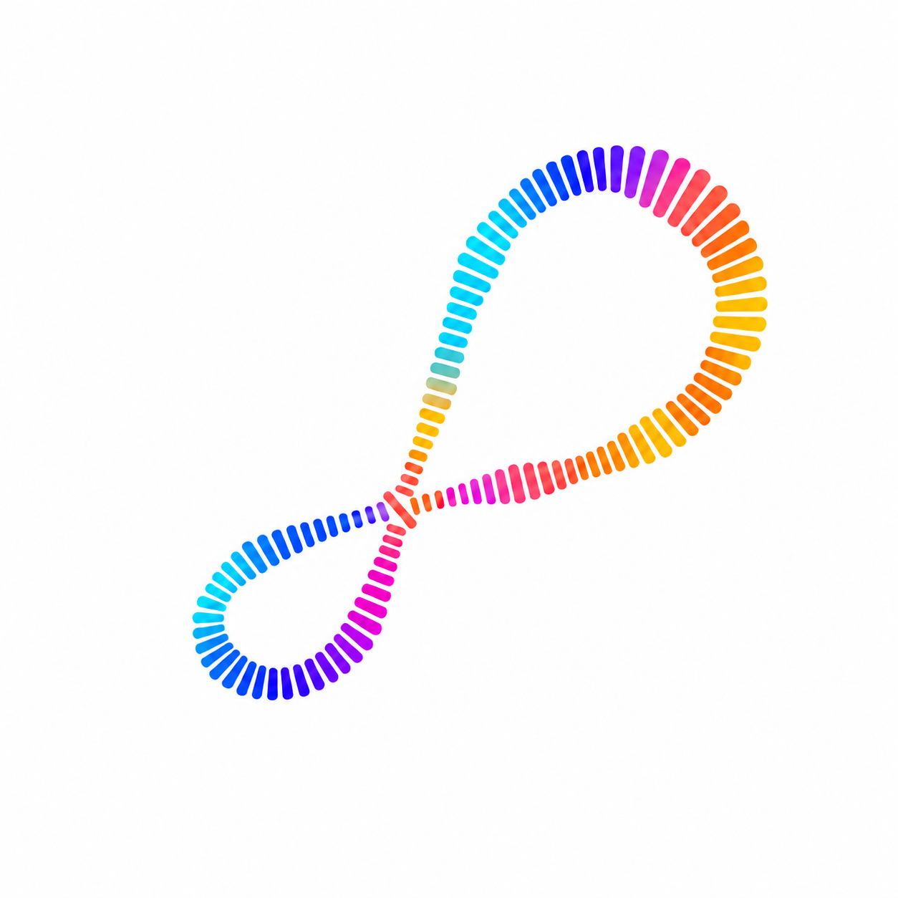

# Sonar

<p align="center"></p>

Control your Mac by moving your hand above the keyboard. Sonar plays a high-frequency tone through the built-in speakers and listens for changes in its reflection. No camera or wearable required.

**Experimental.** Scrolling and gallery navigation have worked on the development Mac. Accuracy varies with your hand movement, Mac, and room. This isn't a finished replacement for your trackpad.

## What you can try

- **Scroll:** lift your palm to scroll, then lower it to reset. Two short downward pushes switch direction. Works in the practice reader or other apps with Accessibility access.
- **Gallery:** sweep sideways to send left/right arrow keys to Chrome, or browse the built-in gallery. Use **Reverse directions** to match your preferred movement. Chrome needs to be in front, with an image viewer open that accepts arrow keys. Return strokes can still cause mistakes.
- **Signal:** watch the microphone signal and how it changes as you move. The flowing waves are an illustration driven by the signal, not a picture of your hand.
- **Other experiments:** Distance and Position are works in progress. Distance and Position do not provide dependable hand height, 3D tracking, or a spatial point cloud.

Sonar senses movement toward and away from the audio hardware. Sideways gestures are inferred from that signal; it doesn't recognize fingers or reliably know your hand's physical position.

## Build on your Mac

You need macOS 14 or later and Apple's command-line developer tools. Install the tools with `xcode-select --install` if needed.

```sh
git clone https://github.com/eperez28/sonar.cool.git
cd sonar.cool
./script/build_and_run.sh
```

This builds and tests the app, installs it to `~/Applications/Sonar.app`, then opens it. No paid developer account or downloaded paper is needed. The practice reader includes sample pages.

To build without installing or opening anything:

```sh
./script/build_and_run.sh --build-only
```

The app and ZIP are written to `outputs/`. Automated tests check the code; they don't prove that gestures work on your hardware. Another Mac still needs a real hand test.

## First run

Allow microphone access. Allow Accessibility if you want to control other apps. Choose a mode, press Start, and keep still during the startup countdown. Sessions run until you stop them. Stop is always available from the menu bar; Control–Option–Command–Space also stops the session.

Use the built-in speakers and microphone. Bluetooth audio is excluded. Some people can hear the tone: stop if it is audible or uncomfortable. We haven't established safety for pets or measured sound levels across Macs.

If macOS stops recognizing Accessibility access after a rebuild, remove the old entry and add the current app again. For repeated development, signing with the same certificate helps preserve access.

## Privacy

Microphone audio stays in memory and isn't saved or uploaded. Recent motion readings are saved locally in `~/Library/Caches/Sonar/` for debugging when a scrolling session stops. Optional verification runs also write reports there.

## Developer options

Set `SONAR_SIGNING_IDENTITY` to use your own signing certificate. Otherwise the script signs locally without a certificate. Set `SONAR_INSTALL_PATH` to keep an existing installation in its original location. The internal executable and bundle identifier retain the old SonarLab name to preserve app identity.

`SONAR_PAPER_PATH` optionally adds a PDF to your local practice reader. The paper isn't distributed here. `--verify-audio` runs a short microphone/speaker check; `--verify-scroll` checks the practice reader with simulated gestures.

## Credit and license

Inspired by [SoundWave: Using the Doppler Effect to Sense Gestures](https://www.microsoft.com/en-us/research/project/soundwave-using-the-doppler-effect-to-sense-gestures/), by Sidhant Gupta, Dan Morris, Shwetak Patel, and Desney Tan (CHI 2012). Their research demonstrated gesture sensing with existing speakers and microphones. Sonar is a separate experimental implementation, not an official Microsoft product.

Sonar's source is available under the [MIT license](LICENSE). That license does not cover the SoundWave paper. No Apple 3D models are included.
